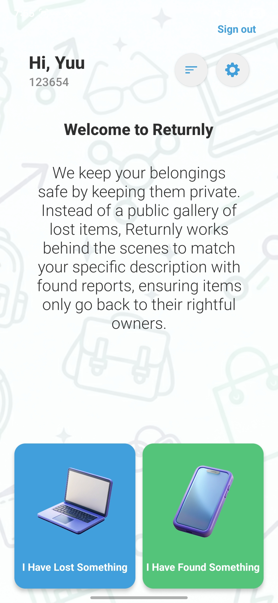
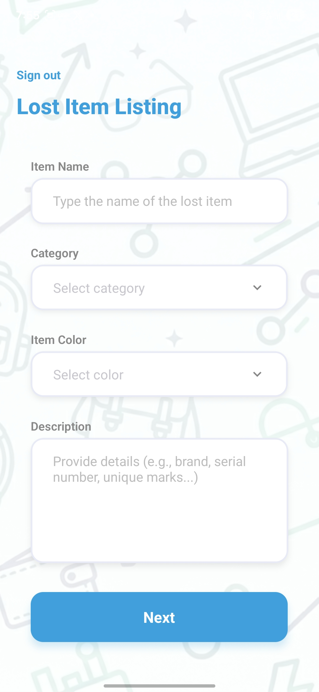
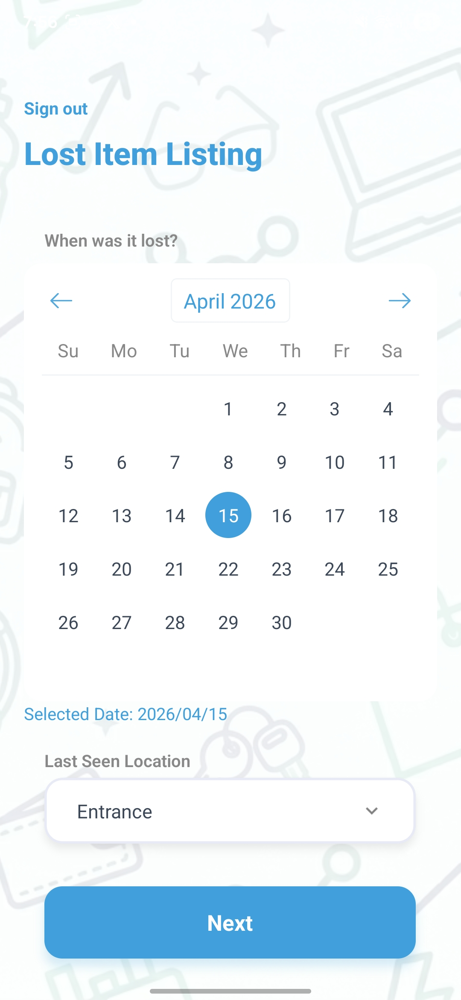
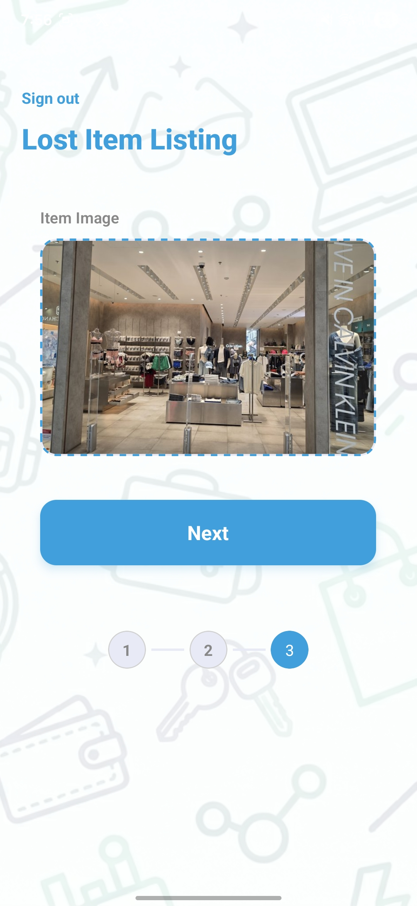
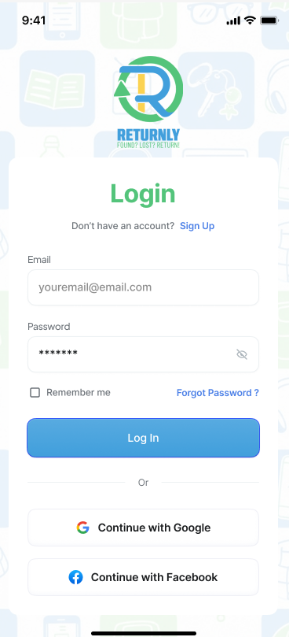
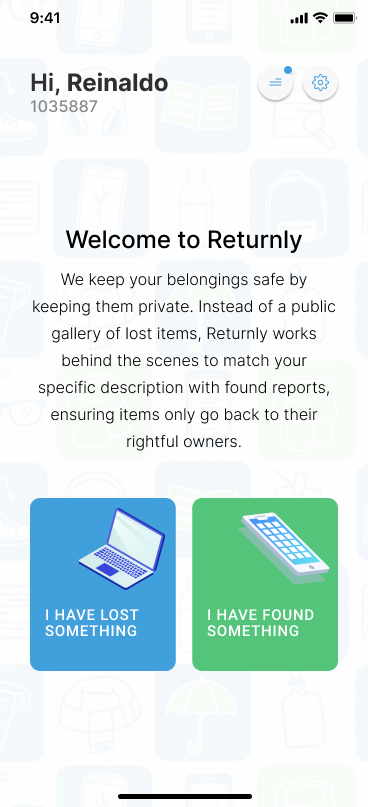
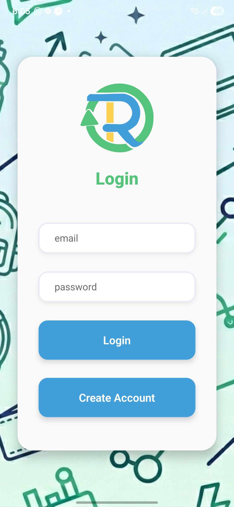
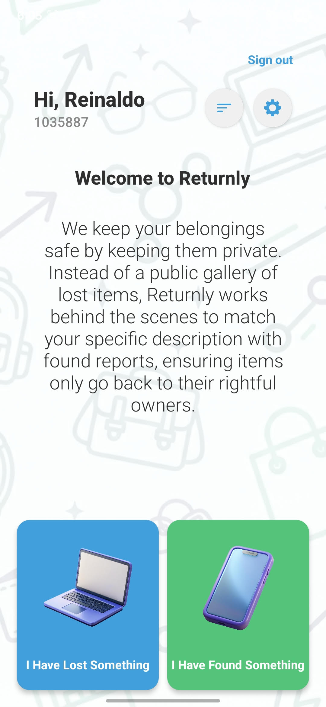

# Returnly Version 1.5 (25/04/2026)

## 🔧 Dependencies

- npx expo install expo-image-picker
- npx expo install react-native-modern-datepicker

---

## ✨ Features

- **Lost / Found Items Listing:** Individual forms to create listing. Including calendar, image picker and location.
- **SignUp created:** A new screen dedicated for registration of new user. Now a form asking about name and student number.
- **Dynamic Name and Student No:** Now the name and student no displayed on the home screen is dynamic. Displays the correct information of the person logged in.

---

## ⚡ Features to implement / improve

- **Sign Out:** Currently the sign out button is not prperly taking the user to the login page.
- **Navigation:** When navigating to previous pages when swiping, the app closes instead of taking it back one page.
- **Camera:** Work on the camera feature.

---

## 📸 Screenshots

|                   SignUp Screen                    |            New Landing with Dynamic Info            |
| :------------------------------------------------: | :-------------------------------------------------: |
|  |  |

|                Lost Item Listing 01                |                Lost Item Listing 02                |                Lost Item Listing 03                |
| :------------------------------------------------: | :------------------------------------------------: | :------------------------------------------------: |
|  |  |  |

---

# Returnly Version 1.0

> An elegant solution for recovering lost belongings while maintaining privacy.

Returnly is a React Native application built with **Expo** and **Firebase**. It moves away from the "public gallery" model of lost-and-found apps, instead using a private matching system to ensure items are returned safely to their rightful owners.

---

## 📸 Figma Mockups

|                      Login Screen                       |                      Landing Screen                       |
| :-----------------------------------------------------: | :-------------------------------------------------------: |
|  |  |

---

## 📸 Screenshots

|                     Login Screen                      |                        Dashboard                        |
| :---------------------------------------------------: | :-----------------------------------------------------: |
|  |  |

---

## ✨ Features

- **Secure Authentication:** Powered by Firebase Auth for seamless sign-in/sign-out flows.
- **Modern UI/UX:** A clean, airy design using semi-transparent containers and a vibrant green palette.
- **Intelligent Layouts:** Optimized for all screen sizes using React Native Flexbox.
- **Custom Branding:** Includes a custom-branded splash screen and integrated logo assets.
- [TO BE IMPLEMENTED]**Privacy First:** Hidden matching logic ensures that lost items aren't publicly listed.
- [TO BE IMPLEMENTED]**Lost / Found Items Listing:** Individual forms to create listing. Including calendar, image picker and location.

---

## 🛠️ Tech Stack

- **Framework:** [React Native](https://reactnative.dev/) via [Expo](https://expo.dev/)
- **Navigation:** [Expo Router](https://docs.expo.dev/routing/introduction/) (File-based routing)
- **Backend:** [Firebase](https://firebase.google.com/) (Authentication & Firestore)
- **Styling:** StyleSheet API with dynamic Flexbox positioning
